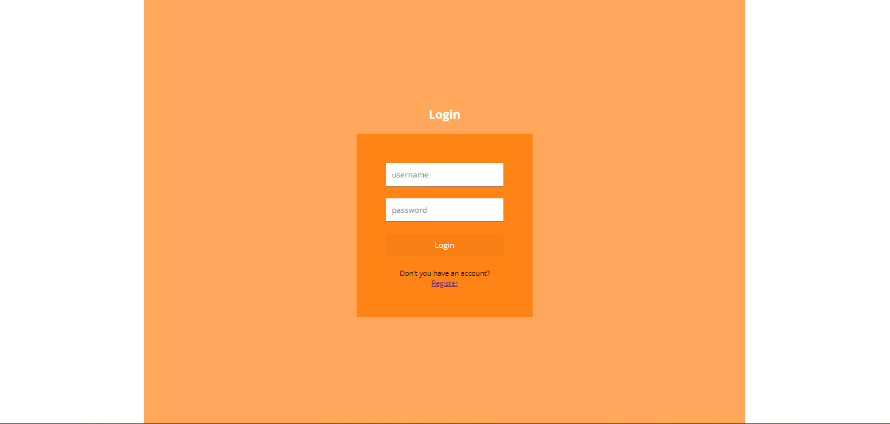
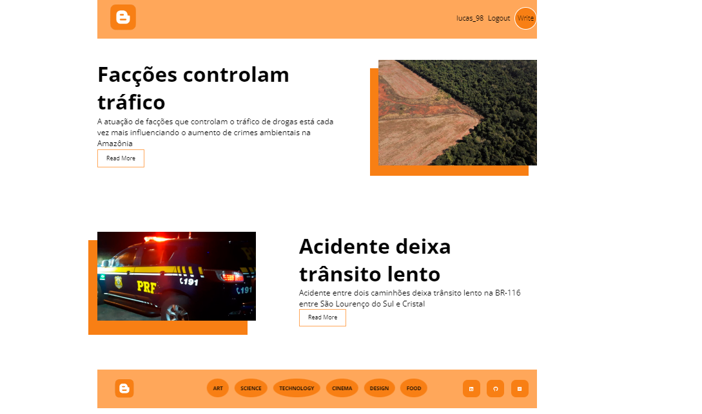
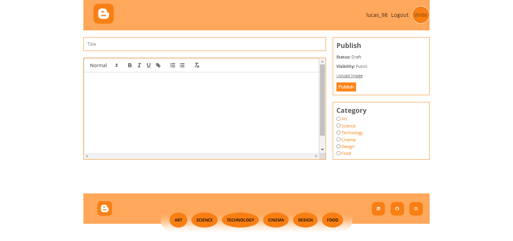
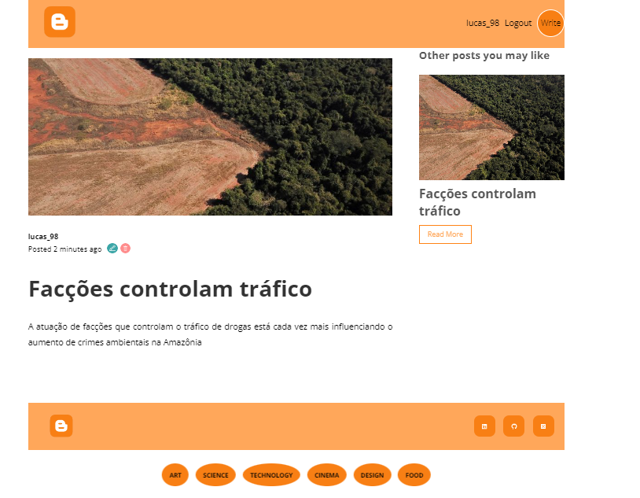

# Blog

🚀 Um blog de notícias que pode ser utilizado por qualquer empresa jornalistica! 🚀

### Pré-requisitos

Antes de começar, você vai precisar ter instalado em sua máquina as seguintes ferramentas:

Além disto é bom ter um editor para trabalhar com o código como [VSCode](https://code.visualstudio.com/)

* Realize o download do projeto

1. git clone https://github.com/lucasrp98/blog

* Instale as dependência e inicialize o servidor

3. yarn install
4. yarn dev

ou 

3. npm install
4. npm dev

### 🛠 Tecnologias

As seguintes ferramentas foram usadas na construção do projeto:

- [React](https://pt-br.reactjs.org/)
- [JavaScript] (https://developer.mozilla.org/en-US/docs/Web/JavaScript)
- [Node.JS] (https://nodejs.org/en/)
- MySQL (https://www.mysql.com/)

### Status
<h4 align="center"> 
	🚧  React Select 🚀 Em andamento ...  🚧
</h4>

### Screenshots

<h1 align="center">
  
</h1>
<h1 align="center">
  
</h1>
<h1 align="center">
  
</h1>
<h1 align="center">
  
</h1>

Feito de ❤️ por Lucas Ribeiro👋🏽 Entre em contato!

<h1 align="center">
  
</h1>

   

